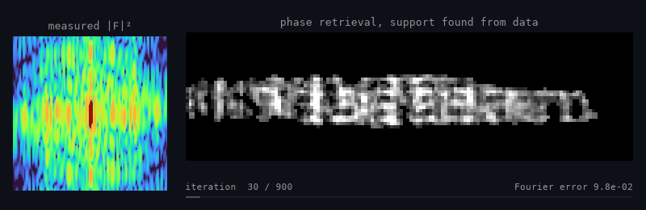

<h1>Isaac Yong (용이삭)</h1>

<strong>X-ray physics · Inverse problems · Scientific software</strong> 
M.S. student in Physics, Sogang University

  <a href="https://nanisaac.github.io"><strong>Portfolio</strong></a> ·
  <a href="https://github.com/NaNIsaac-Research">Research</a> ·
  <a href="https://nanisaac.github.io/notes/">Notes</a> ·
  <a href="https://blog.naver.com/sjbpepper">Blog</a> ·
  <a href="mailto:isaacyong@naver.com">Contact</a>

  

Not measured data: a simulated diffraction intensity
reconstructed with <a href="https://github.com/NaNIsaac/QoraPhase">QoraPhase</a>.
<a href="./scripts/name_gif.py">Reproduce the animation</a>.

X-ray measurements record intensities, not structures directly. I develop
numerical models and software to extract structural information from diffraction,
reflectivity and coherent imaging data.

My work spans inverse problems, time-dependent scattering and beamline data
processing, primarily in Python (NumPy, JAX and PyTorch).

## Organizations

- **[NaNIsaac-Research](https://github.com/NaNIsaac-Research)** holds research
  code with recorded results and limits: TraTT and ReflectoLearn.
- **[tendlane](https://github.com/tendlane)** builds tools for running several
  AI coding agents side by side, starting with pepperpaw.
- **[neurin-ocha](https://github.com/neurin-ocha)** is 느린 오차, a music
  project: songwriting and lyric videos made with
  [coverlyric](https://github.com/neurin-ocha/coverlyric).

## Selected research

- **[TraTT](https://github.com/NaNIsaac-Research/TraTT) — transient acoustic diffraction.**
  Simulates Bragg satellites during acoustic-wave propagation using
  time-dependent Takagi–Taupin equations.
  [Calculated findings](https://github.com/NaNIsaac-Research/TraTT/blob/main/docs/FINDINGS.md) ·
  [KPS 2026 Fall poster](https://github.com/NaNIsaac-Research/TraTT/blob/main/figures/poster/poster_preview.jpg).
- **[ReflectoLearn](https://github.com/NaNIsaac-Research/ReflectoLearn) — XRR inverse problems.**
  Combines neural-network initialization with physics-based fitting and
  investigates parameter ambiguity and identifiability.
  [Findings and limits](https://github.com/NaNIsaac-Research/ReflectoLearn/blob/main/docs/FINDINGS.md).
- **[QoraPhase](https://github.com/NaNIsaac/QoraPhase) — phase retrieval.**
  A JAX package for iterative reconstruction of objects from diffraction
  intensities with missing phase information.
  [Synthetic demonstration](https://github.com/NaNIsaac/QoraPhase/blob/main/docs/reconstruction.png) ·
  [Measured-data limitations](https://github.com/NaNIsaac/QoraPhase/blob/main/docs/benchmarks/measured.md).
- **[QoraFlow](https://github.com/NaNIsaac/QoraFlow) — XFEL data processing.**
  Groups pump–probe detector frames by laser state and delay, applies corrections
  and extracts time traces from diffraction peaks.
  [Processing steps](https://github.com/NaNIsaac/QoraFlow/blob/main/docs/pipeline.md) ·
  [Simulated example](https://github.com/NaNIsaac/QoraFlow/blob/main/docs/pipeline_example.png).

## Software and open source

### Scientific software

- **[QoraPhaseCU](https://github.com/NaNIsaac/QoraPhaseCU)** explores
  C++20/CUDA implementations of phase retrieval, alongside the JAX work.
- **[xray.ooguy](https://xray.ooguy.com)** provides interactive calculators
  for X-ray and beamline work.
- **[qoraplot](https://github.com/NaNIsaac/qoraplot)** provides Matplotlib
  layouts for publication figures; **[cvdkit](https://github.com/NaNIsaac/cvdkit)**
  combines color-vision-aware palettes with marker and line styles.

### Developer tools

- **[codigest](https://github.com/NaNIsaac/codigest)** packages selected code,
  diffs and terminal output into context for coding agents.
- **[pepperpaw](https://github.com/tendlane/pepperpaw)** (the
  `herdr-courier` package) is designed to prevent agent prompts from interrupting human typing.
- **[hanfix](https://github.com/NaNIsaac/hanfix)** repairs terminal commands
  entered with the Korean keyboard layout.

[Technical notes](https://nanisaac.github.io/docs/) ·
[Repository index](REPOSITORIES.md)

## Evidence and reproducibility

Results and limitations are recorded in the
[evidence and reproduction guide](EVIDENCE.md).

<strong>Recorded results and limitations</strong>

| Work | Recorded result | What this does **not** prove |
| --- | --- | --- |
| [TraTT](https://github.com/NaNIsaac-Research/TraTT/blob/main/docs/FINDINGS.md) | Calculated acoustic-satellite overshoot mapped over **11,211** parameter pairs; selected full Takagi–Taupin checks agree with the reduced model. | No comparison to a measured transient dataset. |
| [ReflectoLearn](https://github.com/NaNIsaac-Research/ReflectoLearn/blob/main/docs/fisher_global/reports/RESULTS-BASIN.md) | **935** bounded local-fit refinements. Six incorrect parameter regions require at least **10⁴ counts** to distinguish from the reference in the studied conditions (5 in test group R2a, 1 in X2e). | Does not search every possible solution or establish accuracy on a measured film. |
| [Public XRR counts](https://github.com/NaNIsaac-Research/ReflectoLearn/blob/main/docs/fisher_global/reports/RESULTS-HCAL2.md) | **100** repeated public scans: median dispersion index **1.34** versus a Poisson benchmark near 1 (**draft; not independently verified**). | One experimental setup; the supported verdict requires a post-pre-check amendment. Under the original exclusion rule there is **no verdict**; the excess-noise source is unknown. |
| [QoraPhase](https://github.com/NaNIsaac/QoraPhase/blob/main/docs/benchmarks/cxidb.md) | Synthetic images were reconstructed; on two public coherent-diffraction datasets (CXIDB), the published images were **not reproduced**. | Matching diffraction intensity does not prove the reconstructed image is correct. |

<strong>Recent research and upstream contributions</strong>

<!-- research:start -->
### Research organization

- `NaNIsaac-Research/TraTT` [fix: README figures on an opaque white background](https://github.com/NaNIsaac-Research/TraTT/pull/42) merged
- `NaNIsaac-Research/TraTT` [ci(publish): run the shared publish gates before the tratt upload](https://github.com/NaNIsaac-Research/TraTT/pull/41) merged
- `NaNIsaac-Research/ReflectoLearn` [feat(predict): negative intensity option, recorded with the prediction](https://github.com/NaNIsaac-Research/ReflectoLearn/pull/67) merged
- `NaNIsaac-Research/TraTT` [docs: one scientific report replaces PAPER.md; prior-art reading of the referee list (Entry 91)](https://github.com/NaNIsaac-Research/TraTT/pull/40) merged
- `NaNIsaac-Research/TraTT` [docs: drop duplicate summaries and process references from reader docs](https://github.com/NaNIsaac-Research/TraTT/pull/39) merged
- `NaNIsaac-Research/TraTT` [chore: declare the test command for pr-land](https://github.com/NaNIsaac-Research/TraTT/pull/38) merged
- `NaNIsaac-Research/ReflectoLearn` [refactor: take the forward physics from reflectosim](https://github.com/NaNIsaac-Research/ReflectoLearn/pull/65) merged
- `NaNIsaac-Research/ReflectoLearn` [docs: paper draft on identifiability and search reach in XRR fits](https://github.com/NaNIsaac-Research/ReflectoLearn/pull/66) open
<!-- research:end -->

<!-- upstream:start -->
### Upstream

- `tendlane/pepperpaw` [feat(agents): show lanes stopped on purpose from a configured stops command](https://github.com/tendlane/pepperpaw/pull/69) merged
- `tendlane/pepperpaw` [docs: keep the record word tombstone as the English term](https://github.com/tendlane/pepperpaw/pull/68) merged
- `tendlane/pepperpaw` [docs: mirror the task-dispatch examples and human questions in Korean](https://github.com/tendlane/pepperpaw/pull/67) merged
- `tendlane/pepperpaw` [ci: run the shared publish gates before the PyPI upload](https://github.com/tendlane/pepperpaw/pull/66) merged
- `tendlane/pepperpaw` [fix(inputline): skip agy background-task rows under the input box](https://github.com/tendlane/pepperpaw/pull/65) merged
- `tendlane/pepperpaw` [fix: release held messages to returning new sessions without repeats](https://github.com/tendlane/pepperpaw/pull/64) merged
- `tendlane/pepperpaw` [fix: dismiss agy CLI experience survey with Escape](https://github.com/tendlane/pepperpaw/pull/63) merged
- `tendlane/pepperpaw` [fix(dispatch): a pointer typed into a usage-stopped Claude Code pane is not sent](https://github.com/tendlane/pepperpaw/pull/62) merged
<!-- upstream:end -->

Pepper (후추), my black-and-tan Shiba Inu, takes care of the contribution garden.

<picture>
  <source media="(prefers-color-scheme: dark)"
          srcset="./assets/pepper/pepper-harvest-dark.svg" />
  <source media="(prefers-color-scheme: light)"
          srcset="./assets/pepper/pepper-harvest-light.svg" />
  
</picture>

Previously SJB7777 (renamed October 2026).
